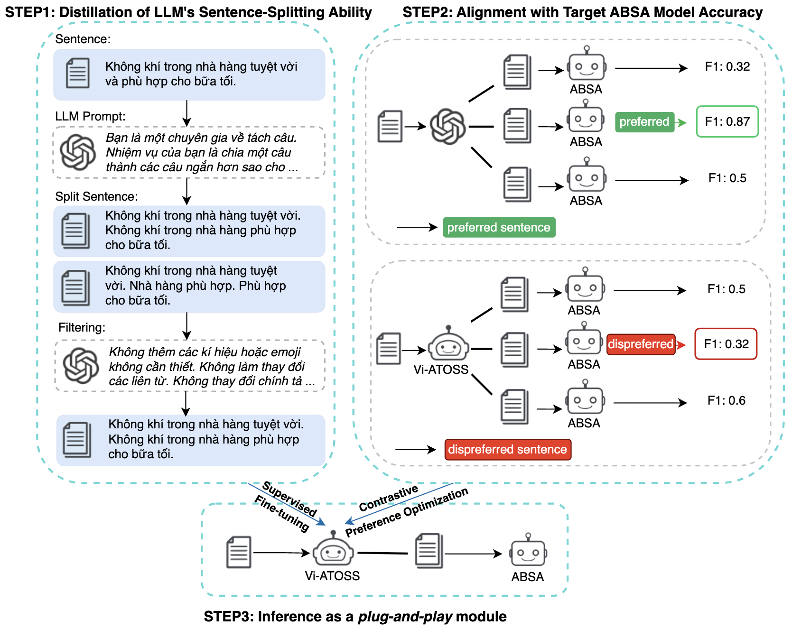

# Vi-ATOSS – Vietnamese Aspect Term Oriented Sentence Splitter

This repository contains the implementation and experimental results of **Vi-ATOSS**, a Vietnamese adaptation of the **Aspect-Term Oriented Sentence Splitter (ATOSS)** framework for **Aspect-Based Sentiment Analysis (ABSA)**.

Vi-ATOSS is designed as a **plug-and-play preprocessing module** that simplifies complex Vietnamese sentences into clearer, aspect-focused sentences, helping downstream ABSA models achieve better performance **without modifying their parameters**.

---

## 📌 Project Overview

Aspect-Based Sentiment Analysis (ABSA) aims to extract fine-grained sentiment information at the **aspect level**.  
However, Vietnamese reviews often contain:

- Long and compound sentences  
- Multiple aspects and opinions in a single sentence  
- Implicit aspect–opinion relations  

These properties make it difficult for existing ABSA models to correctly extract **aspect-level sentiment structures**.

To address this problem, **Vi-ATOSS** introduces an **aspect-oriented sentence splitting strategy** that:

- Breaks compound sentences into **simpler, clearer sentences**
- Ensures **each split sentence focuses on one aspect term**
- Preserves the original meaning and wording as much as possible

Vi-ATOSS is inspired by the ATOSS framework and adapted for **Vietnamese language characteristics** and **Vietnamese ABSA benchmarks**.

---

## 🧠 Methodology

### Aspect-Term Oriented Sentence Splitting

Given a Vietnamese review sentence containing multiple aspects, Vi-ATOSS:

1. Identifies aspect-related structures  
2. Splits the sentence so that:
   - Each resulting sentence contains **one aspect term**
   - The subject is explicitly stated
   - Original spellings and wording are preserved

**Example**:

> *“Không gian quán đẹp nhưng đồ ăn hơi nguội và phục vụ chậm.”*

→ *“Không gian quán đẹp. Đồ ăn hơi nguội. Phục vụ chậm.”*

This simplification significantly reduces ambiguity for ABSA models.

---

## 🏗️ Training Strategy

Vi-ATOSS is trained using a **two-stage optimization pipeline**:

### Stage 1 – LLM Distillation
- Generate split sentences using a large language model
- Train a Vietnamese Seq2Seq model to learn sentence splitting behavior
- Objective: **general sentence splitting capability**

### Stage 2 – Preference Alignment
- Align the splitter with a **specific ABSA model**
- Use **Contrastive Preference Optimization (CPO)** to favor sentence splits that:
  - Improve downstream ABSA F1-score
  - Avoid ambiguous or redundant splits

This design enables both:
- **General-purpose splitting**
- **Model-specific optimization**

---

## 📈 Experimental Results

We evaluate two variants of Vi-ATOSS:

- **General**: trained only via LLM distillation  
- **Specific**: further aligned to the target ABSA model using preference optimization (DPO / CPO)

#### Key Results

- **Vi-ATOSS (General)** consistently **degrades performance**, indicating that generic sentence splitting is not sufficient.
- **Vi-ATOSS (Specific)** consistently **improves F1-score across all backbones**.

| Backbone | Baseline F1 | + Vi-ATOSS (Specific) | Δ F1 |
|--------|-------------|-----------------------|------|
| ViT5-base | 29.35 | 30.26 | **+0.91** |
| ViT5-large | 29.36 | 29.89 | **+0.53** |
| mT5-base | 27.33 | 28.38 | **+1.05** |
| **mT5-large** | **32.12** | **32.68** | **+0.56** |

The best overall result is achieved by **mT5-large + Vi-ATOSS (Specific)** with **F1 = 32.68**.

### Practical Takeaway

Experimental results show that:

- Sentence structure is a **key bottleneck** in Vietnamese ACOS
- **Aspect-oriented sentence splitting must be aligned to the target ABSA model**
- Vi-ATOSS improves performance **without retraining or modifying ABSA models**

Overall, Vi-ATOSS provides a **lightweight but effective improvement** for Vietnamese ABSA systems, especially for extracting structured sentiment quadruplets from complex sentences.

---

## 📄 Full Report

[A detailed technical report](report.pdf) describing the **motivation, methodology, training procedure, and full experimental analysis** of Vi-ATOSS is included in this repository.

Readers interested in implementation details, ablation studies, and deeper discussions are encouraged to consult the full report.

---

## 📌 Notes

This repository is developed for **academic and research purposes**.  
Feedback, issues, and research discussions are very welcome.
